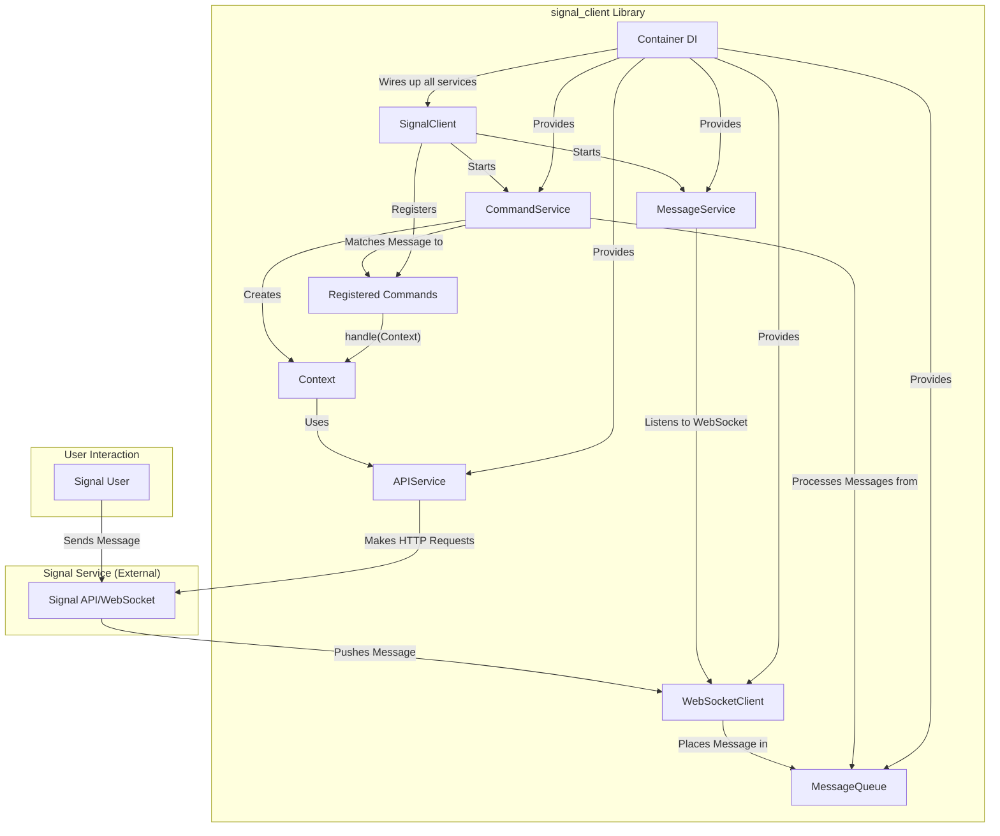

# Signal Client Library Architecture

This document provides a high-level overview of the `signal-client` library's architecture. It describes the core components, their responsibilities, and how they interact to create a functioning Signal bot.

## System Architecture Diagram

The following diagram illustrates the data flow and component interactions within the `signal-client` library.

## Core Components

The library is built around a few core components that work together to receive, process, and respond to Signal messages.

### 1. `SignalClient`

- **File:** `signal_client/bot.py`
- **Responsibility:** This is the main entry point for the library. It initializes the application, holds the dependency injection container, and manages the lifecycle of the primary services. The user of the library interacts primarily with this class to register commands and start the bot.

### 2. `Container`

- **File:** `signal_client/container.py`
- **Responsibility:** A dependency injection (DI) container that wires together all the services and components of the application. It manages the instantiation of services, ensuring that dependencies are provided where needed. This promotes loose coupling and makes the system more modular and testable.

### 3. `MessageService` & `WebSocketClient`

- **File:** `signal_client/services/message_service.py`, `signal_client/infrastructure/websocket_client.py`
- **Responsibility:** The `WebSocketClient` establishes a persistent connection to the Signal service to receive incoming messages in real-time. The `MessageService` orchestrates this process, listening for new messages via the WebSocket and placing them into the central `MessageQueue` for asynchronous processing.

### 4. `MessageQueue`

- **File:** `signal_client/container.py` (defined)
- **Responsibility:** An `asyncio.Queue` that acts as a central buffer for incoming messages. This decouples the message receiving logic from the message processing logic, allowing the system to handle bursts of messages gracefully without blocking.

### 5. `CommandService`

- **File:** `signal_client/services/command_service.py`
- **Responsibility:** This service continuously monitors the `MessageQueue`. When a new message appears, it dequeues it and attempts to match it against all registered `Command`s. If a match is found, it creates a `Context` object and executes the command's `handle` method.

### 6. `Command`

- **File:** `signal_client/command.py`
- **Responsibility:** A protocol that defines the interface for all bot commands. Developers implement this protocol to create new commands. Each command specifies its `triggers` (the text or pattern that invokes it) and contains the `handle` method with the core logic to be executed.

### 7. `Context`

- **File:** `signal_client/context.py`
- **Responsibility:** A crucial object that encapsulates the state of an incoming message (who sent it, what it said, etc.). It is passed to a `Command`'s `handle` method and provides a high-level API for interacting with the message, such as `reply()`, `react()`, and `send()`. It abstracts away the direct use of the `APIService`.

### 8. `APIService`

- **File:** `signal_client/infrastructure/api_service.py`
- **Responsibility:** This service provides a client for interacting with the Signal REST API. It is used by the `Context` object to perform actions like sending messages, adding reactions, and setting typing indicators. It handles the low-level details of making authenticated HTTP requests to the Signal service.
