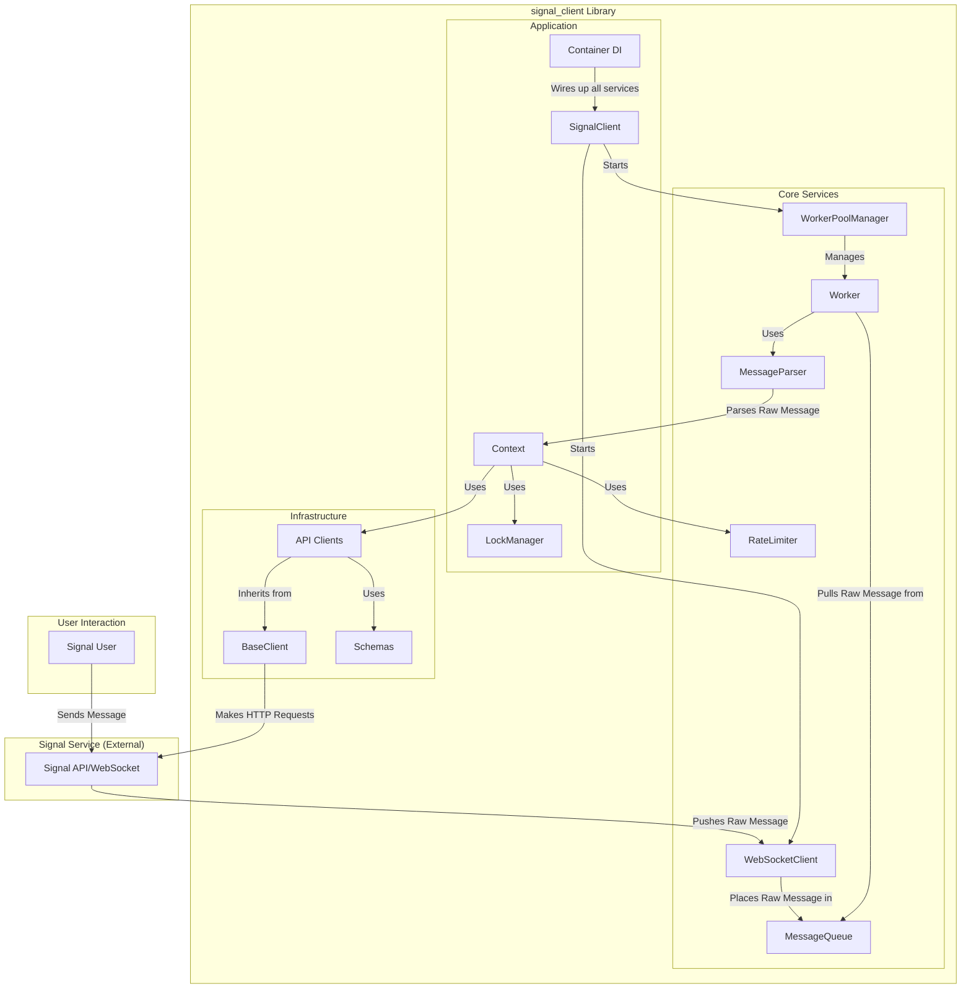

# Architectural Overview

This document provides a high-level overview of the architecture for the `signal-client` library. It is intended to serve as a knowledge base for contributors and a guide for future development.

## 1. Core Principles

The architecture is built on the following non-negotiable principles from our Coding Standards:

- **Simplicity (KISS):** All solutions must be simple and avoid unnecessary complexity.
- **Single Responsibility Principle (SRP):** One file, one purpose. One function, one action.
- **Pragmatism Over Trends:** Use proven, stable technologies appropriate for the task.
- **Resilience and Performance at Scale:** The system must be stable and responsive under heavy, concurrent load.

## 2. System Architecture: A Managed, Resilient Core

The architecture is designed to be **resilient, performant, and scalable**. It is built around two key concepts: a **Managed Worker Pool** for processing and a **Vertically Sliced Infrastructure** for external communication.

### 2.1. The Resilient Core: Managed Worker Pool

- **`WebSocketClient`:** Receives raw JSON messages from the Signal service. Its only job is to put the raw message into the `MessageQueue`.
- **`MessageQueue`:** An `asyncio.Queue` that acts as a central buffer. This provides **backpressure**, preventing the system from being overwhelmed by a burst of messages.
- **`MessageParser`:** A service responsible for parsing the raw JSON messages from the `MessageQueue` into structured `Message` objects.
- **`WorkerPoolManager`:** Creates, starts, and supervises a **fixed, configurable number of `Worker` tasks**. This provides **bounded concurrency**, ensuring the system remains stable and does not exhaust resources.
- **`Worker`:** A long-running task that sits in a loop, pulls a raw message from the queue, uses the `MessageParser` to create a `Message`, matches it to a command, creates a `Context`, and executes the command's `handle` method.
- **`RateLimiter`:** A service that ensures the bot does not exceed the API rate limits of the Signal service.

### 2.2. The Future-Proof Infrastructure: Vertical Slicing

- **`BaseClient`:** A shared base class that manages the `aiohttp.ClientSession`, authentication, base URL, and common error handling. This enforces the **DRY principle**.
- **`API Clients`:** A collection of small, focused clients (e.g., `groups_client.py`, `messages_client.py`) that inherit from the `BaseClient`. Each client is responsible for a single API resource, ensuring **SRP**.
- **`Schemas`:** A dedicated directory (`infrastructure/schemas/`) containing all the Pydantic models for API requests and responses (DTOs).

### 2.3. The Application Layer

- **`SignalClient`:** The main entry point. It initializes the `Container` and starts the `WorkerPoolManager` and `WebSocketClient`.
- **`Container`:** The dependency injection container that wires everything together.
- **`Context`:** The object passed to commands, providing a high-level API. It is injected with the specific API clients it needs.
- **`LockManager`:** A service that provides `asyncio.Lock` objects to commands via the `Context`. This allows developers to easily write thread-safe code and prevent race conditions.

## 3. Implementation Plan

This section outlines the high-level plan that was followed to refactor the library to its current state.

1.  **Refactor the Infrastructure:**
    - Create the `BaseClient`.
    - Decompose the `APIService` into vertically sliced `API Clients`.
    - Create the `schemas` directory and move all DTOs from the `domain` layer.
    - Delete the `APIService` and the old DTO files.
2.  **Implement the Resilient Core:**
    - Reinstate the `MessageQueue`.
    - Delete the `CommandService`.
    - Create the `Worker` and `WorkerPoolManager` services.
    - Refactor the `MessageService` to be a simple producer for the `MessageQueue`.
3.  **Implement Concurrency Tools:**
    - Create the `LockManager` service.
4.  **Rewire and Test:**
    - Update the `Container` to reflect the new services.
    - Update the `SignalClient` to start the new services.
    - Update all tests to mock the new, specific services and clients.

This plan has resulted in a library that is simple, robust, and scalable.
