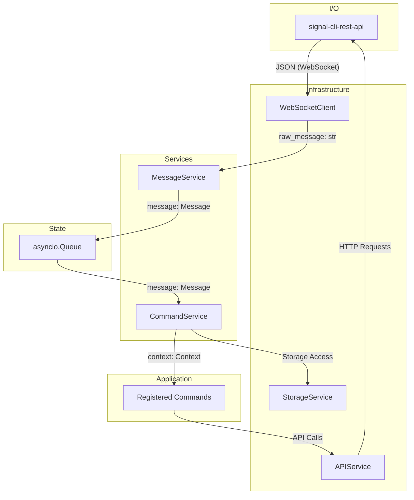

# Architecture

This document provides a detailed look into the technical architecture of `signal-client`. It's intended for developers who want to understand the library's internals, contribute to its development, or build complex applications on top of it.

## Design Principles

The library is built with the following architectural principles in mind:

- **Asynchronous**: Built on `asyncio` for non-blocking I/O, enabling high performance and concurrency.
- **Decoupled**: Services are loosely coupled via an `asyncio.Queue` for message passing and a `dependency-injector` container for managing dependencies. This makes the system modular and easy to test.
- **Service-Oriented**: Functionality is encapsulated in services with single responsibilities, promoting separation of concerns and maintainability.

## System Architecture

The following diagram illustrates the main components of the system and how they interact.

### Component Diagram

### Components

The system is composed of several key components:

- **`Container`**: A dependency injection container for wiring system components together.
- **`WebSocketClient`**: Manages the WebSocket connection to the `signal-cli-rest-api` and yields raw message strings.
- **`MessageService`**: The ingress point for all messages. It consumes raw JSON from the `WebSocketClient`, deserializes it into `Message` models, and enqueues them for processing.
- **`CommandService`**: Consumes `Message` objects from the queue, matches them to registered commands, and executes the command's `handle` method.
- **`APIService`**: An HTTP client for the `signal-cli-rest-api`. It's used by commands to send messages, reactions, and perform other actions.

## Execution Flow

The journey of a message from receipt to response follows these steps:

1.  **Initialization**: `SignalClient.start()` concurrently starts the `MessageService` (to listen for incoming messages) and the `CommandService` (to process them).
2.  **Ingress**: The `WebSocketClient` receives a JSON string from the Signal API.
3.  **Deserialization**: The `MessageService` parses the JSON into a `Message` Pydantic model, normalizing the data structure.
4.  **Enqueue**: The `Message` object is put onto the shared `asyncio.Queue`.
5.  **Dequeue**: The `CommandService` picks up the `Message` object from the queue.
6.  **Dispatch**: The `CommandService` creates a `Context` object, which provides a high-level API for the command to interact with the system.
7.  **Match**: The service iterates through all registered commands and calls their `_should_trigger()` method to find one that matches the incoming message.
8.  **Execute**: The `handle(context)` method of the matched command is called, containing the business logic.
9.  **Egress**: The command handler uses the `Context` object to call the `APIService` and send a response (e.g., a reply or a reaction).

## Core Abstractions

The library provides a few key abstractions to simplify command development:

- **`Command` Protocol**: The contract that all command handlers must follow.
  - `triggers: list[str | re.Pattern]`: A list of strings or regex patterns that activate the command.
  - `whitelisted: list[str]`: An optional list of phone numbers that are allowed to trigger the command.
  - `handle(self, context: Context)`: The method containing the command's business logic.
- **`Context` Object**: A stateful object passed to each command handler, providing a high-level API for interacting with the Signal service.
  - `message: Message`: The inbound message that triggered the command.
  - `reply()`: A helper method to send a message that quotes the original.
  - `react()`: A helper method to add an emoji reaction to the original message.
- **`Message` Model**: A Pydantic model that represents an incoming message. It normalizes the various message structures from the Signal API into a consistent and easy-to-use format.
