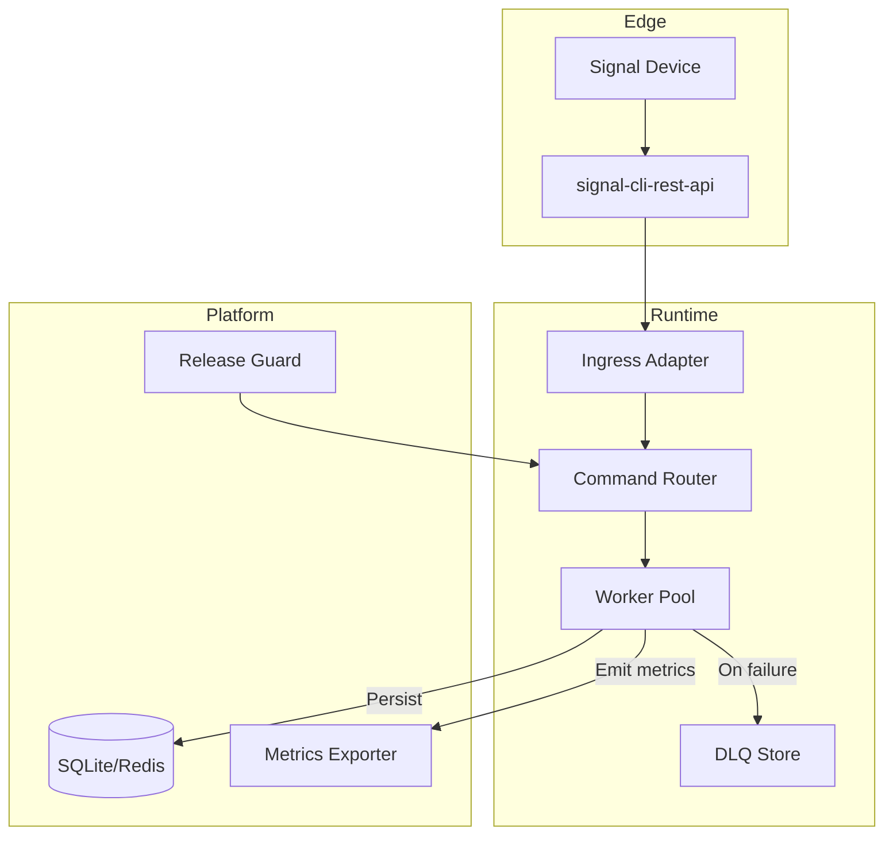

# Architecture

Understanding how Signal Client processes messages and executes commands. This technical overview covers the runtime architecture, component interactions, and deployment patterns.

## System diagram



!!! info "CLI Integration"
    The CLI tools (`inspect-dlq`, `release-guard`, `audit-api`, `pytest-safe`) are utility commands that work alongside the Signal Client runtime. They provide debugging, monitoring, and testing capabilities for development and operations.

## Component Overview

### Message Processing Pipeline

The Signal Client processes incoming messages through several coordinated components:

| Component | Responsibility | Implementation Details |
| --- | --- | --- |
| **Ingress Adapter** | Message reception and normalization | Polls signal-cli REST API `/v1/receive` endpoint, handles authentication, normalizes webhook payloads |
| **Command Router** | Pattern matching and handler dispatch | Evaluates registered command triggers (string/regex), applies access control, routes to handlers |
| **Worker Pool** | Concurrent command execution | Async task execution with configurable concurrency, handles backpressure and rate limiting |
| **Dead Letter Queue** | Failed message handling | Persists failed messages with error context, accessible via `inspect-dlq` CLI tool |
| **Context Provider** | Handler execution environment | Provides `Context` objects with message data and Signal API client access |

### Data Flow

```python
# Simplified message processing flow
async def process_message_flow():
    # 1. Ingress: Poll for new messages
    messages = await rest_api.receive_messages()
    
    # 2. Router: Match commands and create tasks
    for message in messages:
        matching_commands = router.find_matches(message)
        for command in matching_commands:
            task = create_handler_task(command, message)
            worker_pool.submit(task)
    
    # 3. Worker: Execute handler with context
    async def execute_handler(command, message):
        context = Context(message, api_clients)
        try:
            await command.handler(context)
        except Exception as e:
            dlq.store_failed_message(message, e)
```

## Runtime Configuration

### Threading and Concurrency

Signal Client uses Python's `asyncio` for concurrent message processing:

```python
# Default configuration
worker_pool_size = 4        # Concurrent command handlers
queue_size = 200           # Message buffer size
polling_interval = 5.0     # REST API polling frequency (seconds)
```

### Storage Backend

The library supports multiple storage backends for persistence:

/// tab | SQLite (Default)
```python
# Embedded SQLite for development and small deployments
config = {
    "storage": {
        "type": "sqlite",
        "path": "~/.local/share/signal-client/data.db"
    }
}
```

**Characteristics:**
- Zero-configuration setup
- File-based storage
- Suitable for single-instance deployments
- Automatic schema migrations
///

/// tab | Redis
```python
# Redis for production deployments
config = {
    "storage": {
        "type": "redis",
        "url": "redis://localhost:6379/0"
    }
}
```

**Characteristics:**
- Network-based storage
- Supports clustering and replication
- Better performance for high-throughput bots
- Requires separate Redis server
///

### Message Processing Modes

/// tab | Polling Mode (Default)
```python
# REST API polling configuration
config = {
    "ingress": {
        "mode": "polling",
        "interval": 5.0,
        "timeout": 30.0
    }
}
```

**Behavior:**
- Periodically calls `/v1/receive` endpoint
- Reliable but higher latency
- Works with any signal-cli-rest-api setup
- Configurable polling interval
///

/// tab | Webhook Mode
```python
# Webhook configuration (if supported)
config = {
    "ingress": {
        "mode": "webhook",
        "bind_address": "0.0.0.0",
        "bind_port": 8081
    }
}
```

**Behavior:**
- Real-time message delivery
- Lower latency, higher throughput
- Requires webhook-capable signal-cli setup
- Network configuration dependencies
///

## Deployment Patterns

### Development Setup

```python
# Simple development bot
import asyncio
from signal_client.bot import SignalClient
from signal_client.command import Command

async def main():
    client = SignalClient()
    
    # Register commands
    ping_cmd = Command(triggers=["ping"])
    ping_cmd.with_handler(ping_handler)
    client.register(ping_cmd)
    
    # Start processing
    await client.start()

async def ping_handler(context):
    await context.reply(SendMessageRequest(message="Pong!", recipients=[]))

if __name__ == "__main__":
    asyncio.run(main())
```

### Production Deployment

```python
# Production bot with proper configuration
import asyncio
import logging
from signal_client.bot import SignalClient

# Configure logging
logging.basicConfig(
    level=logging.INFO,
    format='%(asctime)s - %(name)s - %(levelname)s - %(message)s'
)

async def main():
    # Load configuration from environment
    client = SignalClient()
    
    # Register commands from modules
    from my_bot.commands import register_all_commands
    register_all_commands(client)
    
    # Start with error handling
    try:
        await client.start()
    except KeyboardInterrupt:
        logging.info("Shutting down gracefully...")
    except Exception as e:
        logging.error(f"Bot crashed: {e}")
        raise

if __name__ == "__main__":
    asyncio.run(main())
```

### Process Management

/// tab | systemd Service
```ini
# /etc/systemd/system/signal-bot.service
[Unit]
Description=Signal Bot
After=network.target

[Service]
Type=simple
User=signal-bot
WorkingDirectory=/opt/signal-bot
Environment=SIGNAL_CLIENT_NUMBER=+1234567890
Environment=SIGNAL_CLIENT_REST_URL=http://localhost:8080
ExecStart=/opt/signal-bot/venv/bin/python main.py
Restart=always
RestartSec=10

[Install]
WantedBy=multi-user.target
```
///

/// tab | Docker Compose
```yaml
# docker-compose.yml
version: '3.8'
services:
  signal-bot:
    build: .
    environment:
      - SIGNAL_CLIENT_NUMBER=+1234567890
      - SIGNAL_CLIENT_REST_URL=http://signal-api:8080
    depends_on:
      - signal-api
    restart: unless-stopped
    volumes:
      - ./data:/app/data

  signal-api:
    image: bbernhard/signal-cli-rest-api:latest
    ports:
      - "8080:8080"
    volumes:
      - ./signal-data:/home/.local/share/signal-cli
```
///

## Security Considerations

### Signal Credential Management

Signal Client requires access to Signal device credentials managed by signal-cli:

```bash
# Signal credentials are stored in signal-cli's data directory
~/.local/share/signal-cli/
├── data/
│   └── +1234567890.d/
│       ├── identity-key
│       ├── pre-keys/
│       └── sessions/
```

!!! warning "Credential Security"
    - Never commit Signal credentials to version control
    - Use proper file permissions (600) for credential directories
    - Consider encrypted storage for production deployments
    - Backup credentials securely before device changes

### Access Control Patterns

```python
# Implement command-level access control
admin_numbers = ["+1234567890", "+0987654321"]

admin_command = Command(
    triggers=["restart", "shutdown"],
    whitelisted=admin_numbers
)

# Or implement custom middleware for complex authorization
class AuthMiddleware:
    async def before_command(self, context: Context) -> bool:
        user_number = context.message.source
        if not self.is_authorized(user_number):
            await context.reply(SendMessageRequest(
                message="❌ Unauthorized access",
                recipients=[]
            ))
            return False
        return True
```

### Network Security

```python
# Configure secure REST API communication
config = {
    "signal_service": {
        "url": "https://signal-api.internal:8080",  # Use HTTPS in production
        "timeout": 30.0,
        "verify_ssl": True
    }
}
```

## Performance Characteristics

### Message Throughput

Typical performance metrics for Signal Client deployments:

| Deployment Type | Messages/minute | Concurrent Handlers | Memory Usage |
|----------------|-----------------|-------------------|--------------|
| Development | 10-50 | 2-4 | 50-100 MB |
| Small Bot | 100-500 | 4-8 | 100-200 MB |
| Active Bot | 500-2000 | 8-16 | 200-500 MB |

### Scaling Considerations

```python
# Tune worker pool for your workload
config = {
    "worker": {
        "pool_size": 8,           # Concurrent command handlers
        "queue_size": 500,        # Message buffer size
        "retry_attempts": 3,      # Failed message retries
        "retry_delay": 5.0        # Delay between retries (seconds)
    }
}
```

**Bottlenecks to monitor:**
- signal-cli REST API response time
- Command handler execution time
- Storage backend performance (SQLite vs Redis)
- Network latency to Signal servers

!!! tip "Performance Optimization"
    - Use async HTTP clients in command handlers
    - Implement caching for frequently accessed data
    - Monitor Dead Letter Queue for failed messages
    - Use Redis for high-throughput deployments
