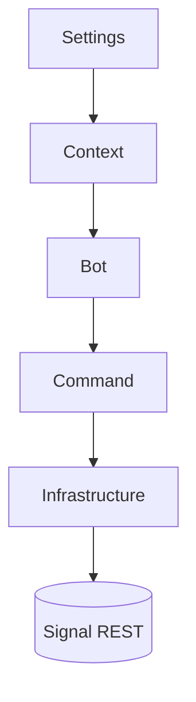

# Architecture

Signal-client groups runtime code by bot surface area. Each module exposes async APIs and typed contracts.

## Module Map

| Module | Responsibility | Key files |
| --- | --- | --- |
| `signal_client.bot` | Lifecycle hooks, retries, scheduling, metrics. | `src/signal_client/bot/` |
| `signal_client.command` | Validation, decorators, structured replies. | `src/signal_client/command/` |
| `signal_client.context` | Settings, dependency injection containers. | `src/signal_client/context/` |
| `signal_client.infrastructure` | Transports, persistence, REST compatibility. | `src/signal_client/infrastructure/` |

## Dependency Injection

Use Dependency Injector to wire collaborators. Avoid module-level singletons so tests can override dependencies.

## Async Patterns

- `async`/`await` all handlers.
- Wrap blocking IO via thread executors.
- Use `structlog` for structured logging; propagate context through command handlers.

See the [reference](../reference/api.md) for auto-generated API docs.
