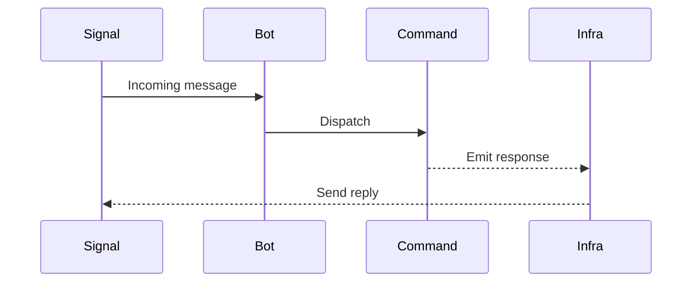

# Observability

Signal-client favors structured logs, metrics, and diagnostics built into the runtime.

## Logging

- Use `structlog` everywhere; inject contextual fields (bot id, command name, attempt).
- Keep message templates consistent (e.g., `event.processed`, `command.failed`).

## Metrics

Record counters/timers for:

- Inbound events processed
- Command execution time
- Retries and dead-letter routing

Integrate with your telemetry stack via dependency injection; expose sinks under `signal_client.infrastructure`.

## Tracing

Mermaid view of a healthy request:

See [diagnostics](diagnostics.md) for runtime tools.
