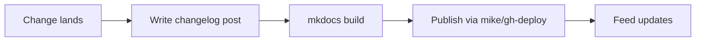

# Release notes

Stay current with signal-client updates, releases, and notable docs changes. Subscribe via RSS/Atom using the feed link in the header.

## At a glance

- Each entry lives under `docs/changelog/YYYY-MM-DD-*.md` via the blog plugin.
- Release automation updates this list; manual posts are welcome for docs and ops changes.
- CTA: read [Release & publishing](../guides/release.md) before shipping a new version.



## Add a new post (runnable)

```bash
poetry run mike deploy --update-aliases <version> latest
poetry run mkdocs new docs/changelog/$(date +%Y-%m-%d)-note.md
```

Fill the new file with front matter (`title`, `date`) and a short summary of what changed.

## Troubleshooting

- **Feed not updating:** ensure `site_url` is set in `mkdocs.yml` and rerun `poetry run mkdocs build --strict`.
- **Broken links:** fix via the redirects plugin (`redirects` section in `mkdocs.yml`) and rebuild.

## Next steps

- Announce major changes in chat/Slack with a link to the latest post.
- Keep guides and examples in sync with any API surface changes noted here.
