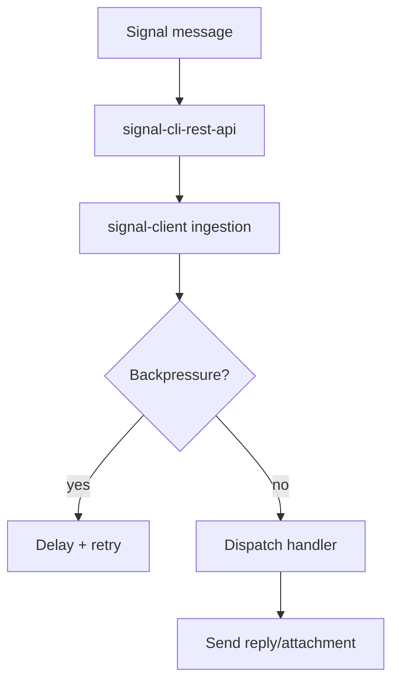

# Components playground

Use this page to preview the authoring building blocks before committing them to guides.

## Badges & macros

- Inline badge: {{ badge("Beta") }}
- Experimental badge: {{ badge("Experimental", "experimental") }}
- CTA macro: {{ cta("Open API", "../reference/api.md") }}

## Admonitions

!!! note "PII redaction"
    Incoming messages are redacted by default. Override with caution.

!!! warning "Backpressure"
    If the inbound queue exceeds the high watermark, new messages are deferred to protect upstream signal-cli.

## Tabs

=== "Local"
    ```bash
    poetry run mkdocs serve
    ```
=== "Docker"
    ```bash
    docker run -it --rm -p 8000:8000 -v $PWD:/docs squidfunk/mkdocs-material
    ```

## Cards & grids

<div class="brand-grid">
  <div class="brand-card">:material-rocket: <strong>Deploy</strong><br/>See [Operations & deployment](../guides/production_deployment.md)</div>
  <div class="brand-card">:material-code-tags: <strong>API reference</strong><br/>Jump to [API reference](../reference/api.md)</div>
  <div class="brand-card">:material-alert-decagram: <strong>Release guardrails</strong><br/>Follow [Release & publishing](../guides/release.md)</div>
</div>

## Annotated code

```python
--8<-- "examples/ping_bot.py"
```

## Diagrams



## Lightbox images

{ data-gallery="assets" }
