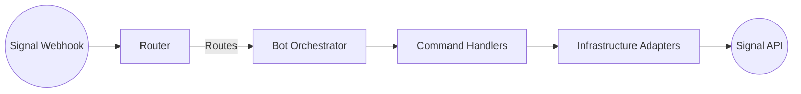

# Discover signal-client

Signal-client packages the primitives required to build reliable Signal automation:

- **Unified runtime** — Async bot surfaces under `src/signal_client/bot`, command routing, and infrastructure adapters.
- **Configuration helpers** — Access deployment settings via `signal_client.context.settings` so secrets stay outside code.
- **Observability baked in** — `structlog` hooks, diagnostic commands, and compatibility checks to keep bots healthy.

## Architecture Highlights

Use the [feature tour](feature-tour.md) for module-by-module detail or head to the [quickstart](../bots/quickstart.md) when you're ready to code.
