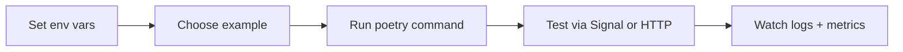

# Examples

Three runnable samples you can copy, run, and extend. All assume the environment from [Getting started](getting_started.md) is exported and `signal-cli-rest-api` is reachable.

## Overview

| Example | What it shows | Run command |
| --- | --- | --- |
| Ping bot | Minimal handler + reply | `poetry run python examples/ping_bot.py` |
| Reminder bot | Parsing + scheduling | `poetry run python examples/reminder_bot.py` |
| Webhook relay | HTTP ingress → Signal send | `poetry run python examples/webhook_relay.py` |

---

## Ping bot — minimal sanity check

- Source: `examples/ping_bot.py`
- Behavior: replies `pong` to `!ping` while exercising websocket ingest + REST send.
- Run: `poetry run python examples/ping_bot.py`

```python
--8<-- "examples/ping_bot.py"
```
1. Reply with a single line of text to prove routing works.
2. Instantiate the client (wires websocket ingest + backpressure).
3. Register the handler before starting.
4. Start the runtime; shutdown with Ctrl+C.

## Reminder bot — scheduling work

- Source: `examples/reminder_bot.py`
- Behavior: `!remind <seconds> <message>` schedules a reminder back to the sender.
- Run: `poetry run python examples/reminder_bot.py`

```python
--8<-- "examples/reminder_bot.py"
```
1. Parse the incoming message content; give usage guidance when missing args.
2. Sleep asynchronously for the requested delay.
3. Send the reminder using the same context (reuses auth + routing).
4. Fire-and-forget via `asyncio.create_task` to avoid blocking other commands.
5. The same client wiring applies: register then start.

## Webhook relay — HTTP to Signal bridge

- Source: `examples/webhook_relay.py`
- Behavior: tiny HTTP server on `127.0.0.1:8081` that accepts `{message, recipients}` JSON and relays to Signal.
- Run: `poetry run python examples/webhook_relay.py`, then POST with `curl` as shown in the file docstring.

```python
--8<-- "examples/webhook_relay.py"
```
1. Load settings from environment to keep secrets out of code.
2. Initialize the application and API clients before binding routes.
3. Validate JSON input and normalize recipients.
4. Reuse the generated API clients to send outbound messages.
5. Start the `aiohttp` server and leave it running until interrupted.

## How to try an example



## Troubleshooting

- **Examples exit immediately:** ensure environment variables are exported; the clients bail when config is missing.
- **Webhook relay returns 400:** send valid JSON with `message` and `recipients`; see the docstring curl example.
- **Reminder bot never fires:** confirm the delay is an integer and the process stays running (no container restarts).

## Next steps

- Use the ping bot as a heartbeat in CI to validate credentials.
- Extend the reminder bot with persistent storage (see [Advanced usage](guides/advanced_usage.md)).
- Wrap the webhook relay with auth and TLS before exposing it beyond localhost.
