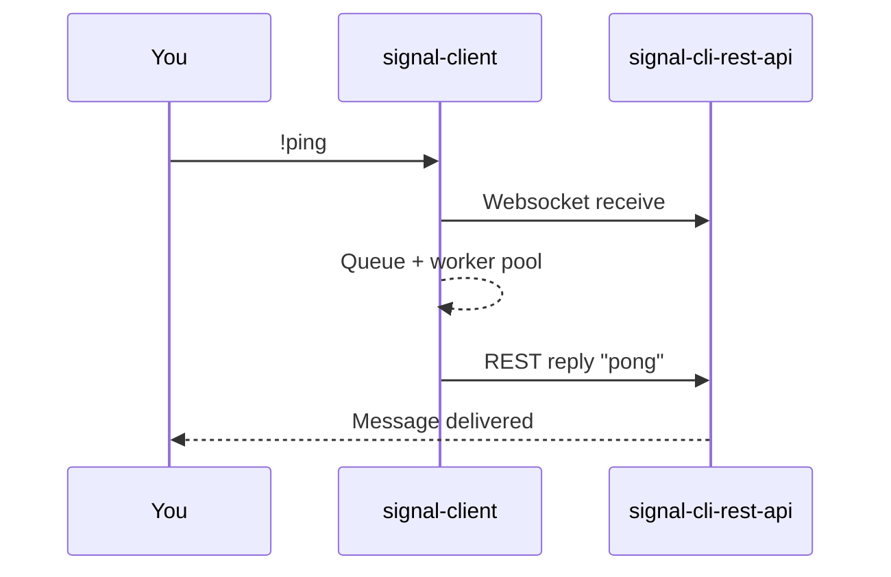

# Getting started

Spin up a minimal bot, verify connectivity, and learn the signals to watch.

## Prerequisites

- Signal phone number already registered with `signal-cli`.
- Running [`bbernhard/signal-cli-rest-api`](https://github.com/bbernhard/signal-cli-rest-api) (websocket + REST) reachable from this host.
- Python 3.10+ with `poetry` or `pip` available.
- Export these environment variables before running:

{{ env_block() }}

!!! warning "Private by default"
    Keep `signal-cli-rest-api` on a private network or localhost. Do not expose it to the public internet.

## Install

=== "Poetry"
    ```bash
    poetry add signal_client
    ```

=== "pip"
    ```bash
    python3 -m pip install signal-client
    ```

## Run your first bot (runnable)

Create `examples/ping_bot.py` or reuse the existing file. The callouts show what matters.

```python
import asyncio
from signal_client import SignalClient, command


@command("!ping")
async def ping(ctx):  # (1)
    await ctx.reply_text("pong")  # (2)


async def main():
    bot = SignalClient()  # (3)
    bot.register(ping)    # (4)
    await bot.start()     # (5)


if __name__ == "__main__":
    asyncio.run(main())
```
1. Commands are lightweight coroutines; decorators register triggers.
2. `ctx` exposes typed helpers for replies, reactions, attachments, and receipts.
3. `SignalClient` wires websocket ingest, queueing, and backpressure controls.
4. Register handlers before starting the runtime.
5. `start()` connects to `signal-cli-rest-api` using your exported URLs.

Run it: `poetry run python examples/ping_bot.py`, then send `!ping` from a contact the bot can reach.

## Health check diagram



## Troubleshooting

- **No websocket events:** double-check `SIGNAL_SERVICE_URL` and that the bot number is registered on `signal-cli`.
- **Replies hang:** verify outbound REST at `SIGNAL_API_URL` is reachable and not blocked by a proxy/firewall.
- **Unicode errors on Windows shells:** ensure `.venv` encoding is UTF-8 or run via `poetry run python ...` inside a UTF-8 terminal.

## Next steps

- Explore [Examples](examples.md) for runnable bots with annotated snippets.
- Layer in middleware and locks in [Advanced usage](guides/advanced_usage.md).
- Prepare for production with [Operations & deployment](guides/production_deployment.md).
