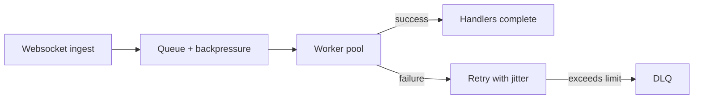

# Advanced usage

Build richer bots with structured routing, middleware, backpressure tuning, and observability hooks.

## Prerequisites

- You have completed [Getting started](../getting_started.md) and can run the ping bot.
- Environment variables from the quick start are already exported.
- Familiarity with async/await and dependency installation via Poetry.

## Routing patterns

```python
from signal_client import SignalClient, command


bot = SignalClient()


@command(r"^!echo\s+(.+)$", case_sensitive=False)
async def echo(ctx):  # (1)
    await ctx.reply_text(ctx.message.message or "")


@command("!admins", whitelisted=["+15551234567"])
async def admins_only(ctx):  # (2)
    await ctx.reply_text("Admins can run operational commands here.")


bot.register(echo)
bot.register(admins_only)
```
1. Regex routing keeps triggers flexible; default match is case-insensitive.
2. Use `whitelisted` to limit who can execute sensitive handlers.

## Middleware with structured logging (runnable)

```python
from collections.abc import Awaitable, Callable
from signal_client import Context, SignalClient


client = SignalClient()


async def log_middleware(
    ctx: Context, next_handler: Callable[[Context], Awaitable[None]]
) -> None:
    ctx.logger.info("handling", message=ctx.message.message)  # (1)
    await next_handler(ctx)  # (2)
    ctx.logger.info("done", source=ctx.message.source)  # (3)


client.use(log_middleware)
```
1. Use the built-in structured logger (supports redaction).
2. Call the `next_handler` to continue the chain; middleware order matters.
3. Record completion with context-rich metadata.

## Resiliency controls

- **Queue & workers:** tune `WORKER_POOL_SIZE`, `WORKER_SHARD_COUNT`, and `QUEUE_SIZE` for throughput. Lower values reduce memory but increase latency.
- **Durable ingest:** set `DURABLE_QUEUE_ENABLED=true` to persist inbound messages (SQLite or Redis per `STORAGE_TYPE`).
- **Dead Letter Queue:** `DLQ_MAX_RETRIES` controls retries before parking a failed message.
- **Rate limiting & circuit breaking:** configure `RATE_LIMIT` and `CIRCUIT_BREAKER_*` to protect `signal-cli-rest-api` during spikes.



## Context helpers (quick sheet)

- Replies: `await ctx.reply_text("pong")`, `await ctx.send_markdown("*hi*")`.
- Attachments: `async with ctx.download_attachments() as files: ...`.
- Reactions/receipts: `await ctx.react("👍")`, `await ctx.send_receipt(ctx.message.timestamp)`.
- Locks: `async with ctx.lock("resource-id"):` when Redis storage is enabled.
- Typing indicators: `await ctx.show_typing()` / `await ctx.hide_typing()`.

## Observability

```python
from signal_client.observability.health_server import start_health_server
from signal_client.observability.metrics_server import start_metrics_server


app = client.app
await app.initialize()
await start_health_server(app, port=8082)   # (1)
await start_metrics_server(port=8000)       # (2)
```
1. Health endpoints expose `/live`, `/ready`, and `/dlq` for probes.
2. Metrics server publishes Prometheus counters/gauges for queues and handlers.

## Troubleshooting

- **Handlers run twice:** ensure each command decorator is applied once and the handler is registered a single time.
- **Locks not acquired:** confirm `STORAGE_TYPE=redis` and Redis credentials are reachable; locks are disabled for memory/SQLite modes.
- **DLQ fills up:** inspect failing payloads, lower `DLQ_MAX_RETRIES`, and add guardrails in middleware to reject unsupported commands early.

## Next steps

- Wire these patterns into the [Examples](../examples.md).
- See [Operations & deployment](production_deployment.md) for environment tuning and process supervision.
- Map APIs in [Reference](../reference/api.md) to handlers for deeper customization.
