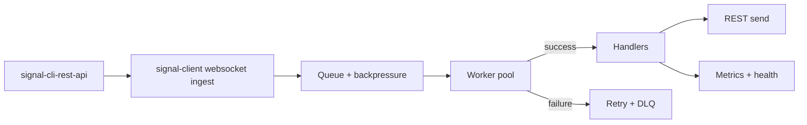

# Operations & deployment

Guide for running signal-client alongside `signal-cli-rest-api` in production.

## Prerequisites

- A healthy `signal-cli-rest-api` reachable on your private network.
- Environment variables exported (or provided via a secrets manager).
- Process manager available (systemd, supervisord, container runtime).

## Runtime shape



## Environment

| Variable | Purpose | Typical value |
| --- | --- | --- |
| `SIGNAL_PHONE_NUMBER` | Bot identity | `+15551234567` |
| `SIGNAL_SERVICE_URL` | Websocket host | `http://localhost:8080` |
| `SIGNAL_API_URL` | REST host | `http://localhost:8080` |
| `STORAGE_TYPE` | `memory` \| `sqlite` \| `redis` | `sqlite` for single node, `redis` for HA |
| `DURABLE_QUEUE_ENABLED` | Persist inbound queue | `true` in prod |
| `DLQ_MAX_RETRIES` | Retries before parking | `5` |
| `RATE_LIMIT` | Max msgs/min | `50` (tune per cluster) |
| `CIRCUIT_BREAKER_*` | Protect upstream REST | See defaults; lower for unstable links |

## Deployment patterns

- **SQLite** for single-node durability: set `STORAGE_TYPE=sqlite` and optionally `SQLITE_DATABASE=signal_client.db`.
- **Redis** for distributed locks/queues: set `STORAGE_TYPE=redis`, `REDIS_HOST`, and `REDIS_PORT`; enables `ctx.lock` and shared ingestion across processes.
- **Backpressure tuning:** adjust `QUEUE_SIZE`, `WORKER_POOL_SIZE`, and `WORKER_SHARD_COUNT` to balance latency vs. memory.
- **Graceful shutdown:** send SIGTERM/SIGINT; the client drains the queue, stops workers, and closes websocket + HTTP sessions.

## Health and metrics (runnable)

```python
from signal_client.observability.health_server import start_health_server
from signal_client.observability.metrics_server import start_metrics_server
from signal_client import SignalClient

client = SignalClient()
await client.start()
await start_health_server(client.app, port=8082)  # (1)
await start_metrics_server(port=8000)             # (2)
```
1. Exposes `/live`, `/ready`, and `/dlq` for probes.
2. Publishes Prometheus metrics for queue depth, websocket status, and handler timings.

## Security and hardening

- Keep `signal-cli-rest-api` off the public internet; front it with a firewall or private network.
- Store secrets outside the repo (env vars, secret manager, or injected files with restricted permissions).
- Enable log redaction (`LOG_REDACTION_ENABLED=true`) so PII does not leak to logs.
- Rotate the Signal phone number token and REST auth tokens regularly; store them in CI/CD secrets.

## Troubleshooting

- **Health endpoints timeout:** confirm the health server port is open on localhost and not blocked by SELinux/AppArmor.
- **Redis locks never release:** check `LOCK_TTL_SECONDS`; ensure system clocks are in sync (NTP) across nodes.
- **High CPU on bursts:** lower `WORKER_SHARD_COUNT` or raise `QUEUE_SIZE`; verify DLQ volume for poisoned messages.

## Next steps

- See the [Release & publishing](release.md) guide before shipping a new version.
- Add dashboards that scrape the metrics endpoint; alert on queue depth and DLQ growth.
- Run the [Examples](../examples.md) in the same environment to validate connectivity.
