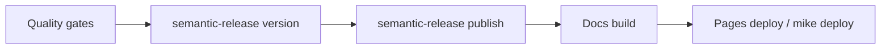

# Release & publishing

Ship new versions with confidence using this checklist.

## Prerequisites

- CI is green on `main`.
- You can publish to PyPI and GitHub Releases (tokens configured in CI secrets).
- Docs build locally with `poetry run mkdocs build --strict`.

## Quality gates (runnable)

```bash
poetry check
poetry run ruff check .
poetry run mypy signal_client tools
poetry run pytest
poetry run mkdocs build --strict
```

## Packaging & verification

- Build artifacts: `poetry build` (wheel + sdist in `dist/`).
- Sanity check the wheel: `python -m pip install dist/signal_client-<version>-py3-none-any.whl` in a clean venv, then run `poetry run python examples/ping_bot.py` with env vars set.
- Tag releases with semantic versioning; the README links to https://cornellsh.github.io/signal-client/.

## Semantic release automation

```bash
poetry run semantic-release version  # bumps version + changelog
poetry run semantic-release publish  # builds + uploads to PyPI/releases
```

## Docs publishing

- Validate: `poetry run mkdocs build --strict`
- Publish to GitHub Pages (if configured): `poetry run mkdocs gh-deploy --clean`
- Versions via `mike`: `poetry run mike deploy --update-aliases <version> latest` then `poetry run mike set-default latest`



## Troubleshooting

- **Release fails on PyPI upload:** ensure credentials are present and not scoped to testpypi; retry after refreshing the token.
- **Docs links break after deploy:** run `poetry run mkdocs build --strict` locally to spot missing references; check redirects in `mkdocs.yml`.
- **Wheel missing files:** confirm `packages = [{include = "signal_client"}]` and that data files are included if added.

## Next steps

- Announce in the changelog (`docs/changelog/` via the blog plugin).
- Update sample bots if API signatures changed.
- Archive the change set with `openspec archive` when the release is deployed.
