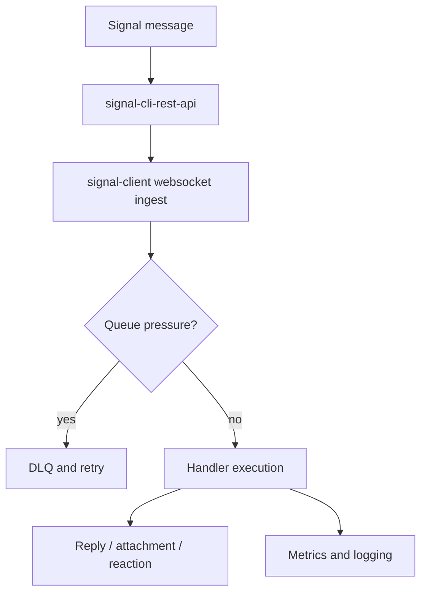

<div class="hero">
  <p class="tagline">{{ brand_tagline }}</p>
  
  <h1>Async Signal bots, production-ready by default</h1>
  <p>Build fast on <code>signal-cli-rest-api</code> with typed helpers, resilient ingestion, and observability baked in. Community-driven; not the official Signal app.</p>
  <div class="actions">
    {{ cta("Get started", "getting_started.md") }}
    {{ cta("View API reference", "reference/api.md", "secondary") }}
  </div>
</div>

## At a glance

<div class="brand-grid">
  <div class="brand-card">
    <strong>Resilience first</strong><br />
    Backpressure, DLQ retries, and rate/circuit breakers keep handlers stable during bursts.
  </div>
  <div class="brand-card">
    <strong>Typed context helpers</strong><br />
    Replies, reactions, attachments, locks, and receipts all live on one ergonomic context.
  </div>
  <div class="brand-card">
    <strong>Operations ready</strong><br />
    Health + metrics servers, structured logging with PII redaction, and storage options (memory, SQLite, Redis).
  </div>
</div>

## Quick start (runnable)

Deploy a minimal ping bot. The annotations explain each step.

```python
import asyncio
from signal_client import SignalClient, command


@command("!ping")
async def ping(ctx):  # (1)
    await ctx.reply_text("pong")  # (2)


async def main():
    bot = SignalClient()  # (3)
    bot.register(ping)    # (4)
    await bot.start()     # (5)


if __name__ == "__main__":
    asyncio.run(main())
```
1. Commands are declared with the `@command` decorator.
2. Use typed helpers on `ctx` for replies, reactions, attachments, and receipts.
3. `SignalClient` wires ingestion, queueing, and backpressure for you.
4. Register handlers before starting the client.
5. `start()` connects to `signal-cli-rest-api` over websocket + REST.

Run it with your environment set: `poetry run python examples/ping_bot.py`.

## Message flow



## Troubleshooting

- No replies? Confirm `SIGNAL_SERVICE_URL` matches your websocket host and the bot number is registered.
- Event loop closed errors? Ensure a single `asyncio.run` entrypoint and avoid running the script twice in the same shell session.
- Messages slow to drain? Lower `WORKER_SHARD_COUNT` or raise `QUEUE_SIZE` in constrained environments.

## Next steps

- Read [Getting started](getting_started.md) for full setup and health checks.
- Try more [Examples](examples.md) with annotated snippets pulled from the source.
- Explore [Advanced usage](guides/advanced_usage.md) for middleware, locks, and observability.
- Review [Operations & deployment](guides/production_deployment.md) before running in production.
