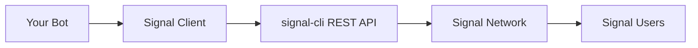

# Overview

Signal Client is a Python library that simplifies building Signal messaging bots. It handles the complexity of Signal's protocol so you can focus on your bot's functionality.

## What Signal Client Provides

- **🤖 Simple Bot Framework** — Write message handlers as async Python functions
- **📱 Signal Integration** — Built on [`signal-cli-rest-api`](https://github.com/bbernhard/signal-cli-rest-api) for reliable messaging
- **⚡ Async Runtime** — Handle multiple messages concurrently with proper error handling
- **🔧 Developer Tools** — CLI utilities for debugging, testing, and monitoring

!!! info "Requirements"
    - Python 3.8 or newer
    - Docker (for signal-cli REST API)
    - A Signal account for device linking
    
    See the [Quickstart](quickstart.md) for setup instructions.

## How It Works

Signal Client connects to Signal through a simple architecture:



### Message Flow

1. **Incoming Messages** — Signal Client polls the REST API for new messages
2. **Command Matching** — Messages are matched against your registered command patterns
3. **Handler Execution** — Your async handler functions process matched messages
4. **Response Sending** — Send replies, reactions, or new messages back through Signal

### Simple Example

```python
from signal_client.bot import SignalClient
from signal_client.command import Command

# Create bot instance
client = SignalClient()

# Define a command handler
async def ping_handler(context):
    await context.reply(SendMessageRequest(message="Pong! 🏓", recipients=[]))

# Register command
ping_cmd = Command(triggers=["ping", "!ping"])
ping_cmd.with_handler(ping_handler)
client.register(ping_cmd)

# Start the bot
await client.start()
```

## Key Features

/// tab | Command System
**Pattern-based message handling**

- String literal triggers: `"help"`, `"status"`
- Regular expressions: `r"weather\s+(.+)"`
- Access control with whitelisting
- Automatic command routing
///

/// tab | Async Runtime
**Concurrent message processing**

- Handle multiple messages simultaneously
- Built-in error handling and retries
- Dead letter queue for failed messages
- Configurable worker pools
///

/// tab | Signal Integration
**Full Signal protocol support**

- Send text messages and attachments
- React to messages with emojis
- Group and direct message support
- Read receipts and typing indicators
///

/// tab | Developer Experience
**Tools for building and debugging**

- CLI utilities for testing and monitoring
- Structured logging and metrics
- Configuration validation
- Hot-reload during development
///

## Next Steps

Ready to build your first Signal bot?

- **[Use Cases](use-cases.md)** — See practical examples and inspiration
- **[Quickstart](quickstart.md)** — Set up your development environment
- **[API Reference](api-reference.md)** — Detailed technical documentation
