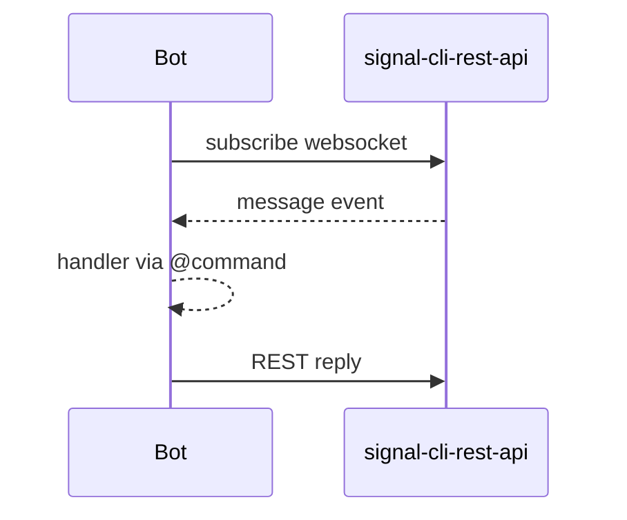

# API reference

Core public surface for building Signal bots. See [Getting started](../getting_started.md) for setup and [Advanced usage](../guides/advanced_usage.md) for patterns.

## Quick usage

```python
from signal_client import SignalClient, command


@command("!ping")
async def ping(ctx):
    await ctx.reply_text("pong")


client = SignalClient()
client.register(ping)
await client.start()
```



## Runtime

::: signal_client.app.bot.SignalClient
    handler: python
    options:
      show_root_heading: false
      show_source: true
      separate_signature: true
      docstring_style: google
      members_order: source

::: signal_client.app.application.Application
    handler: python
    options:
      show_root_heading: false
      show_source: true
      separate_signature: true
      docstring_style: google
      members_order: source

## Commands and context

::: signal_client.core.command.command
    handler: python
    options:
      show_root_heading: true
      show_source: true
      separate_signature: true
      docstring_style: google

::: signal_client.core.context.Context
    handler: python
    options:
      show_root_heading: false
      show_source: true
      separate_signature: true
      docstring_style: google
      members:
        - reply_text
        - send_markdown
        - send_with_preview
        - react
        - send_receipt
        - download_attachments
        - lock
        - show_typing
        - hide_typing

::: signal_client.core.command.Command
    handler: python
    options:
      show_root_heading: false
      show_source: true
      separate_signature: true
      docstring_style: google

## Settings

::: signal_client.core.config.Settings
    handler: python
    options:
      show_root_heading: false
      show_source: true
      separate_signature: true
      docstring_style: google

## Observability

::: signal_client.observability.health_server.start_health_server
    handler: python
    options:
      show_root_heading: true
      show_source: true
      separate_signature: true
      docstring_style: google

::: signal_client.observability.metrics_server.start_metrics_server
    handler: python
    options:
      show_root_heading: true
      show_source: true
      separate_signature: true
      docstring_style: google

::: signal_client.observability.logging.ensure_structlog_configured
    handler: python
    options:
      show_root_heading: true
      show_source: true
      separate_signature: true
      docstring_style: google

## Troubleshooting

- Missing members in the reference? Run `poetry run mkdocs build --strict` to surface mkdocstrings import errors (often missing deps).
- Import path errors: prefer `signal_client.<module>` paths shown above; avoid private modules not exported in `__all__`.

## Next steps

- Use the reference alongside [Examples](../examples.md) to map API calls to runnable scripts.
- See [Advanced usage](../guides/advanced_usage.md) for middleware and resiliency tuning using these APIs.

## Exceptions

::: signal_client.core.exceptions
    handler: python
    options:
      members:
        - AuthenticationError
        - ConfigurationError
        - GroupNotFoundError
        - InvalidRecipientError
        - RateLimitError
        - ServerError
        - SignalAPIError
        - UnsupportedMessageError
      show_root_heading: true
      show_source: true
      separate_signature: true
      docstring_style: google
